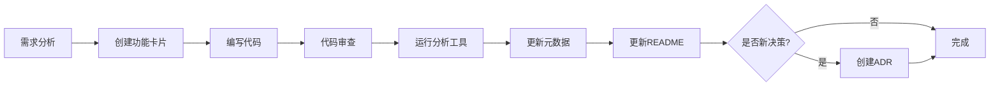

# 知识库协作约定

> **最高准则: 代码是唯一事实 (Code is the Single Source of Truth)**
> 所有文档的最终解释权归于源代码的实际实现。
> 任何文档内容若与代码不符，必须以代码为准,并立即更新文档。

---

## 📋 目录结构

```
开发文档/
├── 00_conventions.md          # 本文档 - 协作约定和最高准则
├── README.md                  # 动态仪表盘 - 项目总览入口
├── 01_features/               # 功能卡片目录
│   ├── F001_data-import/      # 数据导入功能
│   │   ├── README.md          # 功能卡片主文档
│   │   ├── meta.json          # 功能元数据
│   │   └── test-records.md    # 测试记录 (可选)
│   ├── F002_kpi-dashboard/
│   └── ...
├── 02_decisions/              # 架构决策记录 (ADR)
│   ├── ADR-001_状态管理选型.md
│   ├── ADR-002_CSV解析策略.md
│   └── ...
├── 03_technical_design/       # 技术设计文档
│   └── ...
├── 04_refactoring/            # 重构记录
│   └── ...
└── archive/                   # 历史文档归档
    ├── PRD-best.md
    ├── PROGRESS.md
    └── ...
```

【已对齐当前代码事实】

---

## 🔑 核心原则

### 1. 代码优先 (Code-First)

- **定义**: 代码实现是项目真相的唯一来源
- **实践**:
  - ✅ 任何功能状态判断必须基于实际代码审查
  - ✅ 文档更新必须在代码修改后同步进行
  - ❌ 不得基于"计划"或"记忆"标记功能为"已实现"
- **验证**: 定期运行 `node scripts/analyze-codebase.js` 自动同步状态 【已对齐当前代码事实】

### 2. 原子化文档 (Atomic Documentation)

- **定义**: 每个文档专注于单一主题,互相独立但可关联
- **实践**:
  - ✅ 功能卡片 (Features): 一个功能一个目录
  - ✅ 决策记录 (Decisions): 一个技术决策一个ADR
  - ✅ 日志记录 (Logs): 一次重大变更一个日志
- **好处**: 易于维护、版本控制、知识检索

### 3. 可追溯性 (Traceability)

- **定义**: 建立功能↔决策↔问题的双向链接网络
- **实践**:
  - ✅ 功能卡片通过 `related_decisions` 链接决策
  - ✅ 决策记录通过 `affects_features` 链接功能
- ✅ 日志通过 `related_features` 链接功能
- **工具**: 使用 `meta.json` 存储结构化关联关系

---

## 🧠 AI 协作规范：元数据驱动的上下文

> **核心理念**: AI 不是靠“猜”来理解项目，而是靠**精准的元数据索引**。
> 文档不仅是给人看的，更是给 AI 构建 RAG (Retrieval-Augmented Generation) 上下文的索引源。

### 1. 文档即代码 (Docs as Code)

所有 Markdown 文档必须包含 YAML Frontmatter，遵循 [`00_doc_meta_standard.md`](./00_doc_meta_standard.md) 标准。

**必须包含的字段**:
- `id`: 唯一标识符
- `status`: 生命周期状态 (`stable` 为最高置信度)
- `domain`: 业务域边界 (帮助 AI 排除干扰信息)
- `related_code`: **关键！** 建立文档与代码的强关联

### 2. 上下文加载原则

AI 在处理任务时，应根据元数据智能加载上下文：

1.  **明确业务域**: 处理理赔问题时，优先加载 `domain: claims` 的文档。
2.  **代码反查**: 修改 `src/domain/rules/kpi.ts` 前，必须检索 `related_code` 包含该文件的文档。
3.  **置信度过滤**: 遇到冲突时，`status: stable` 的文档优于 `status: draft`，代码实现优于任何文档。

### 3. 维护责任

- **新建文档**: 必须包含完整 Frontmatter。
- **代码重构**: 如果重命名了核心类/文件，必须同步更新引用该文件的文档中的 `related_code` 路径。
- **废弃文档**: 将 `status` 标记为 `deprecated`，切勿直接删除（保留历史上下文）。

---

## ✅ 代码质量修复准则（必须遵守）

本节用于统一“修复代码质量问题”的准则与流程，避免为了通过检查而引入语义破坏或“规避式修复”。

### 1) 禁止规避式修复

- ❌ 不得为了消除 `no-unused-vars` 等告警而对“实际使用的变量”加 `_` 前缀
- ✅ 未使用则删除/移除导入；确需保留则说明理由并保证声明与使用一致

### 2) 下划线前缀使用规范

- ✅ 唯一合法场景：变量/参数在声明后确实完全未被使用
- ✅ ES 解构：`const { used, unused: _unused } = obj`

### 3) 强制验证链（提交前必须全部通过）

```bash
pnpm validate
```

等价于：

```bash
pnpm lint
pnpm tsc --noEmit
pnpm build
```

---

## 📊 可视化全局规范（强制遵守）

> **适用范围**: 所有图表、表格、文字排序展示，包括驾驶舱、报表、对比分析等所有模块。

### 排序统一规则

**核心原则**: 所有数据展示必须按照"**从最差到最好**"的顺序排序。

| 指标类型 | 排序方向 | 目的 | 示例 |
|---------|---------|------|------|
| **正向指标**<br>（越高越好） | **由低到高** | 最差的在前，便于快速发现问题 | 边际贡献率: [5%, 10%, 15%, 20%] |
| **逆向指标**<br>（越低越好） | **由高到低** | 最差的在前，便于快速发现问题 | 赔付率: [90%, 80%, 70%, 60%] |

### 指标分类参考

- **正向指标**: 时间进度达成率、边际贡献率、单均保费、满期率
- **逆向指标**: 变动成本率、赔付率、费用率、出险率、案均赔款、单均费用

### 技术实现要求

1. **使用统一工具函数**: 必须使用 `src/config/thresholds.ts` 中的 `sortByValue()` 函数
2. **配置驱动**: 指标分类由 `METRIC_THRESHOLDS` 配置的 `isHigherBetter` 属性决定
3. **禁止硬编码**: 不得在组件中直接写排序逻辑，必须调用配置化的排序函数

### 强制应用场景

- ✅ 驾驶舱所有图表（柱状图、条形图、热力图、雷达图）
- ✅ 所有对比表格（机构对比、业务类型对比）
- ✅ 所有风险列表（落后机构、超标业务）
- ✅ 所有文字说明（如"排名前5的机构"必须是最差的5个）

### 详细规范文档

完整的排序规范、指标分类和技术实现，参见：
- [核心指标计算引擎 - 7.1 全局排序规范](./03_technical_design/core_calculations.md#71-全局排序规范--强制规则)

---

## 📊 功能状态定义

> **警告**: 状态判断必须基于代码审查,而非文档声明!

| 状态       | 英文标识            | 判断标准                                               | 图标 |
| ---------- | ------------------- | ------------------------------------------------------ | ---- |
| **待实现** | `to_be_implemented` | - 核心文件不存在<br>- 或完整度 < 20%                   | ⏳   |
| **开发中** | `in_progress`       | - 核心文件部分存在<br>- 完整度 20%-49%                 | 🚧   |
| **已实现** | `implemented`       | - 核心文件全部存在<br>- 核心功能可用<br>- 完整度 ≥ 50% | ✅   |
| **已修改** | `modified`          | - 原有实现被重构<br>- API发生破坏性变更                | 🔄   |
| **已废弃** | `deprecated`        | - 功能不再维护<br>- 计划移除                           | ⚠️   |

**状态更新流程:**

1. 开发者完成代码提交
2. 运行 `node scripts/analyze-codebase.js` 生成分析报告 【已对齐当前代码事实】
3. 根据报告更新 `meta.json` 中的 `status` 和 `completeness`
4. 更新功能卡片中的状态描述

---

## 📝 文档规范

### 功能卡片 (Feature Card)

**文件结构:**

```
01_features/F{序号}_{功能ID}/
├── README.md       # 功能主文档
├── meta.json       # 元数据
└── test-records.md # 测试记录 (可选)
```

**`README.md` 模板:**

```markdown
# F{序号}: {功能名称}

> **状态**: {状态图标} {状态描述}
> **优先级**: P{0-2}
> **完整度**: {百分比}%
> **最后验证**: {日期}

## 功能概述

[1-2句话描述功能目的]

## 核心能力

- [ ] 能力1 ({状态})
- [ ] 能力2 ({状态})

## 实现文件

- `src/path/to/file1.ts` - 描述
- `src/path/to/file2.tsx` - 描述

## 相关决策

- [ADR-001](../../02_decisions/ADR-001_xxx.md) - 决策标题

## 测试覆盖

- [ ] 单元测试: {文件路径}
- [ ] 集成测试: {测试场景}

## 已知问题

- [ISSUE-001](../../archive/问题记录表.md#issue-001) - 问题描述 【已对齐当前代码事实】
```

**`meta.json` 模板:**

```json
{
  "id": "F001",
  "name": "数据上传与解析模块",
  "status": "implemented",
  "priority": "P0",
  "completeness": 85,
  "version": "v2.1.0",
  "last_updated": "2025-01-20",
  "last_verified": "2025-01-20",
  "core_files": [
    "src/components/features/file-upload.tsx",
    "src/lib/parsers/csv-parser.ts"
  ],
  "related_decisions": ["ADR-002", "ADR-005"],
  "related_issues": ["ISSUE-003"],
  "tags": ["数据处理", "用户交互", "P0"]
}
```

### 架构决策记录 (ADR)

**命名规范**: `ADR-{序号}_{简短描述}.md`

**模板:**

````markdown
# ADR-{序号}: {决策标题}

> **状态**: {提议|已采纳|已废弃}
> **决策日期**: {日期}
> **决策人**: {姓名}

## 上下文 (Context)

[为什么需要做这个决策?当前面临什么问题?]

## 决策 (Decision)

[我们决定做什么?]

## 理由 (Rationale)

[为什么这么决定?考虑了哪些因素?]

## 替代方案 (Alternatives)

### 方案A: {名称}

- 优点: ...
- 缺点: ...

### 方案B: {名称}

- 优点: ...
- 缺点: ...

## 影响的功能 (Affects)

- [F001](../01_features/F001_data-import/README.md)
- [F003](../01_features/F003_trend-analysis/README.md)

## 后果 (Consequences)

### 正面影响

- ...

### 负面影响

- ...

### 技术债务

- ...

## 代码证据 (Code Evidence)

```typescript
// 实际代码示例
import { create } from 'zustand'
```
````

**文件路径**: `src/store/use-data-store.ts:5-20`

## 参考资料

- [Zustand 官方文档](https://docs.pmnd.rs/zustand)

````

### 开发日志 (Development Log)

**命名规范**: `YYYY-MM-DD_{简短描述}.md`

**模板:**
```markdown
# {日期} - {简短标题}

> **类型**: {功能开发|Bug修复|重构|性能优化}
> **影响范围**: {功能ID列表}
> **开发时长**: {小时数}

## 背景
[为什么做这次变更?]

## 变更内容
### 新增
- 文件A: 功能描述
- 文件B: 功能描述

### 修改
- 文件C: 修改内容
- 文件D: 修改内容

### 删除
- 文件E: 删除原因

## 技术细节
[关键实现逻辑、算法、数据结构]

## 测试验证
- [x] 单元测试通过
- [x] 功能测试通过
- [ ] 性能测试 (待补充)

## 相关功能
- [F001](../01_features/F001_data-import/README.md)

## 问题记录
[遇到的问题和解决方法]
````

---

## 🔄 工作流程

### 功能开发流程



### 文档更新流程

```mermaid
graph LR
    A[代码变更提交] --> B[运行 scripts/analyze-codebase.js] 【已对齐当前代码事实】
    B --> C[检查分析报告]
    C --> D{状态变化?}
    D -->|是| E[更新meta.json]
    D -->|否| F[无需更新]
    E --> G[更新功能卡片]
    G --> H[更新仪表盘README]
```

---

## 🛠️ 工具支持

### 自动化分析工具

**文件**: `scripts/analyze-codebase.js` 【已对齐当前代码事实】

**功能**:

- 扫描 `src/` 目录检测实际实现
- 生成功能完整度报告
- 识别架构模式采用情况
- 输出 `codebase-analysis.json`

**使用方法**:

```bash
node scripts/analyze-codebase.js
【已对齐当前代码事实】
```

### 元数据验证脚本 (待开发)

**功能**:

- 检查所有 `meta.json` 格式正确性
- 验证关联链接有效性
- 检测过期的 `last_verified` 日期

---

## 📌 注意事项

### ❌ 反模式 (Anti-Patterns)

1. **文档先行**: 不要先写文档再实现代码
2. **状态臆测**: 不要基于记忆判断功能状态
3. **孤岛文档**: 不要创建无关联的文档
4. **过时文档**: 不要保留与代码不符的描述

### ✅ 最佳实践 (Best Practices)

1. **代码即文档**: 代码注释清晰,减少文档冗余
2. **小步迭代**: 每次修改只更新相关文档
3. **定期审查**: 每周运行分析工具同步状态
4. **版本管理**: 重大变更创建新的日志记录

---

## 📞 问题反馈

如果发现文档与代码不符,请:

1. 运行 `node scripts/analyze-codebase.js` 确认差异 【已对齐当前代码事实】
2. 创建 Issue 记录到 `archive/问题记录表.md` 【已对齐当前代码事实】
3. 更新相关文档

---

_本文档版本: v1.0.0_
_最后更新: 2025-01-20_
_维护者: 开发团队_

### 文档现实对齐流程

当发现文档与当前代码事实不一致且不涉及设计重写时，应执行“现实对齐（Reality Alignment）”：仅进行事实性修正，确保描述与现状一致；完成后在 `开发文档/开发记录表.md` 增加记录，并注明验证状态。 【已对齐当前代码事实】

### 分析报告产物

`codebase-analysis.json` 为 `node scripts/analyze-codebase.js` 生成的分析产物，建议在关键里程碑随代码一同提交；如需更新，应先运行该脚本再提交最新报告。 【已对齐当前代码事实】
